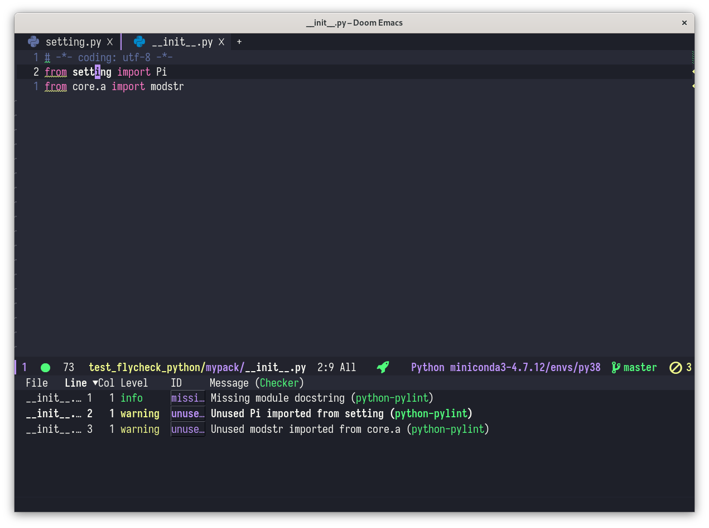
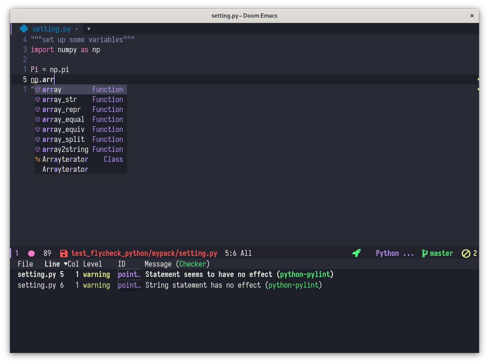

# test\_flycheck\_python

A test Python project to try on-the-fly linting in Doom Emacs, basically using [flycheck](https://github.com/flycheck/flycheck) and [Eglot](https://github.com/joaotavora/eglot).

## Code hierachy

```
.
├── mypack
│   ├── core
│   │   └── a.py
│   ├── __init__.py
│   └── setting.py
└── README.md
```

`setting.py` imports `numpy`.

## flycheck

Use pylint only for linting, switch off the others.
Usually, flycheck will automatically handle the disabled checkers by looking up the lint executable in `PATH`.
So the setup is just to make sure.

```lisp
(use-package! flycheck
  :config
  ; only use pylint, disable others
  ; setq-default acts as a global operation
  (setq-default flycheck-disabled-checkers '(
                python-flake8 python-pycompile python-pyright python-mypy
                )
  )
)
```

See `.pylintrc` for pylint configuration

## Eglot

Use Eglot as the LSP client and `pylsp` as the server.
Install `pylsp` through `conda`

```shell
conda install python-lsp-server[all]
```

Install Eglot by adding to `.doom.d/init.el`

```lisp
:tool
(lsp +eglot)
```

and bind `eglot` to python major mode in config `.doom.d/config.el`

```lisp
(use-package! eglot
  :config
  (add-hook 'python-mode-hook 'eglot-ensure)
)
```

Since I only use `pylsp` as a completer, I tend to disable the linting functionality _globally_ through `eglot-workspace-configuration`.
After some search and tweak, adding the following lines to config works for me

```lisp
(after! eglot
  :config
  (set-eglot-client! 'python-mode '("pylsp"))
  ;;; switched off pycodestyle and pyflakes linting, which are enabled as default in pylsp
  ;;; since the linting is handled by python-pylint in flycheck
  ;;; modified from https://github.com/joaotavora/eglot/issues/590#issuecomment-758233948
  ;;; when using setq, eglot-workspace-configuration is still nil in test project files, opened by projectile
  ;;; use setq-default instead works for me (not enough time to think about why)
  (setq-default eglot-workspace-configuration
        '((pylsp
            (plugins
             (pycodestyle
              (enabled . nil))
             (pyflakes
              (enabled . nil))
             ))
         )
  )
)
```

## Screenshots

linting in `__init__.py`



NumPy completion



## References

- [Doom Emacs and Language Servers](https://rgoswami.me/posts/emacs-lang-servers/)
- [joaotavora/eglot#590](https://github.com/joaotavora/eglot/issues/590)

